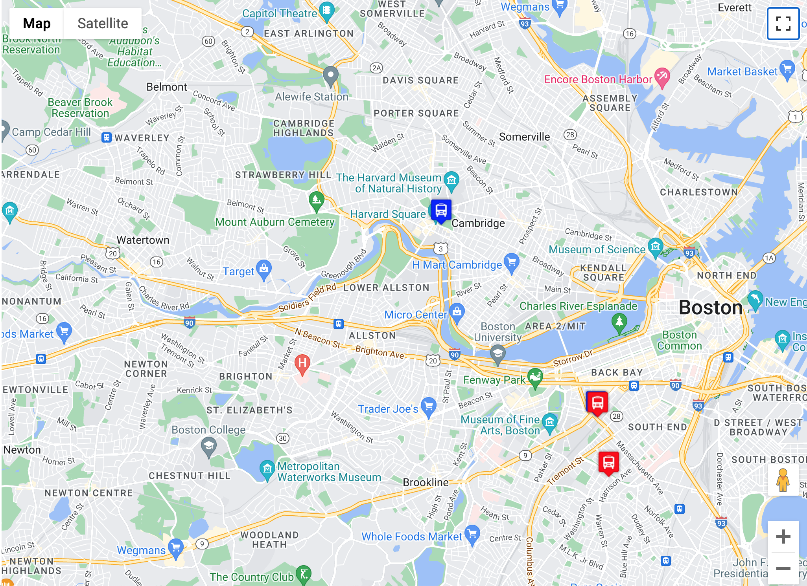

# Real-Time Bus Tracker

The bus location markers are updated every 15 seconds. 
The marker changes color to either blue or red depending on which direction it's going.

I use the Google Maps API to display the live location of buses on a map. I gathered real-time data of the Boston MBTA buses and added it to a Google Map. 

